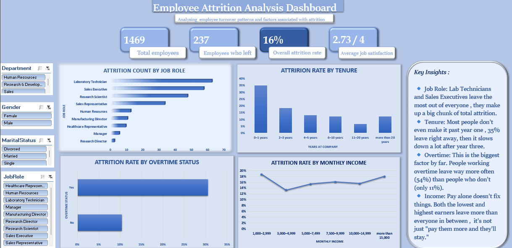

# HR Attrition Analysis

An Excel dashboard analyzing employee attrition at a fictional company, built to figure out where and why people are actually leaving. Made with pivot tables, slicers, and interactive charts.

## Dataset

The dataset (HR-Employee-Attrition.xlsx) is IBM's classic HR Analytics dataset, containing 1,469 employee records with details like department, job role, overtime status, tenure, income, and whether they left the company.

## What I did

**Cleaning:**
- Checked the data for missing values and duplicate rows (none found, but wanted to make sure before building anything on top of it)
- Reviewed each column's data type in Excel — some fields (like EmployeeCount) were constant across every row, so I noted them as not useful for analysis
- Standardized text fields like Department and JobRole so nothing had extra spaces or inconsistent capitalization that could mess up my pivot tables
- Grouped some continuous fields (YearsAtCompany, MonthlyIncome) into buckets like "0–1 years," "2–3 years," etc. so the charts would actually be readable instead of showing dozens of tiny bars
- Added an AttritionFlag helper column (0/1) since Attrition was originally a Yes/No text field, and pivot tables can't calculate percentages off text — this let me get real attrition rates instead of just counts

**Building the dashboard:**
- Built multiple pivot tables to break down attrition by job role, tenure, overtime status, and income bracket
- Created a chart for each of these breakdowns
- Added slicers (Department, Gender, MaritalStatus, JobRole) so the whole dashboard filters together
- Put it all together into one dashboard page

## Dashboard

One standout: overtime is the strongest attrition risk factor in the data — employees working overtime leave at 54%, compared to only 11% for those who don't. Full breakdown by job role, tenure, and income is in the dashboard above.

## A challenge I ran into

My slicers weren't filtering all the charts at the same time — some would update, others wouldn't budge. Turned out it wasn't a slicer connection problem at all — a couple of my pivot tables were pointing to slightly different data ranges (one column off from the others), so Excel treated them as separate data sources even though they looked identical. Fixed it by resyncing all the pivot tables to the same range and reconnecting the slicers.

## Files

- `HR-Employee-Attrition.xlsx` — raw dataset
- `HR-Attrition-Full-Analysis.xlsx` — full workbook (raw data, worksheet, pivot tables, dashboard)
- `HR-Attrition-Dashboard.png` — dashboard preview

## Tools

Excel — pivot tables, slicers, charts, helper columns
